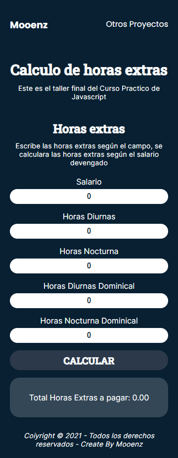

# **Platzi Curso Practico Javascript**

## inicio

## **Taller 1 : Figuras Geometricas.**

### _pasos:_

1. Definir las formulas : Perimetro y area segun la figura.
2. Implementarlas en Javascrpt : Crear la logica del programa.
3. Crear funciones : funciones que calculen tanto perimetro como el area.
4. Integrar JS con Html : src en nuestro html, crear estilos y manipulacion del DOM.

#### Mobile

## **Taller 2 : Porcentajes y descuentos.**.

### _pasos:_

1. Definir las formulas : Investigar las formulas para obtener porcentajes.
2. Implementarlas en Javascript : Crear la logica del programa.
3. Crear funciones : Implementar funciones que calcule porcentajes y descuentos.
4. Integrar JS con Html : crear la interacion con el usuario.

#### Mobile

## **Taller 3 : Promedio, moda, mediana.**

### _pasos:_

1. Definir las formulas : Definir formulas para promedio, moda, mediana.
2. Implementarlas en Javascript : Crear la logica del programa.
3. Crear funciones : Hacer funciones que calcules el promedio, moda y mediana
4. Integrar JS con Html : crear la interacion con el usuario.

#### Mobile

## **Taller 4 : Analisi salarial.**

### _pasos:_

1. Definir las formulas : Definir formulas para nuestro analisis.
2. Implementarlas en Javascript : Crear la logica del programa.
3. Crear funciones : Hacer funciones que calcules el top 10% de salarios.
4. Integrar JS con Html : crear la interacion con el usuario.

#### Mobile

## **Taller 5 : Calcular hora extra.**

### _pasos:_

1. Definir las formulas : Definir formula para calcular las horas extra, cuanto se paga por cada una de ellas.
2. Implementarlas en Javascript : Crear la logica del programa.
3. Crear funciones : Hacer funciones que calcules cuanto se debe pagar en horas extra.
4. Integrar JS con Html : crear la interacion con el usuario.

#### Mobile

