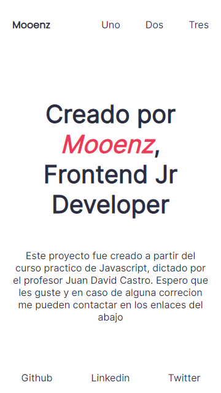

# **Curso Practico de JavaScript**

Curso impartido por le profesor Juan David Castro by platzi

## **Demo** 🚀

[View Demo](https://mooenz.github.io/platzi-curso-practico-js/)

## **Tools** 🔨

- HTML
- SCSS
- JS Vanilla

## **Preview** 📷

## **Contact** 📧

- Linkedin [Mooenz](https://www.linkedin.com/in/mooenz/)
- Web Site [Curriculum Vitae](https://mooenz.github.io/curriculum-vitae/)

## **Licencie** 🛸

This project is MIT licensed

**_With_** ❤️ **_Mooenz_**
