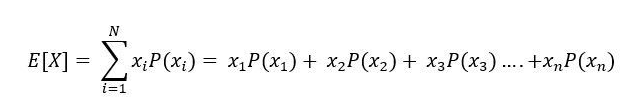

# **Reto: calcula otros tipos de promedio:**

## **¿Cuál tipo de promedio elegiste para trabajar?**
El promedio elejido por mi es **Esperanza Matemática** o **Valor Esperado** y es igual al sumatorio de las probabilidades de que exista un suceso aleatorio, multiplicado por el valor del suceso aleatorio.

## **¿Qué casos de uso tiene tu tipo de promedio?**
Se utiliza en toda disciplina en la que la presencia de sucesos probabilísticos es inherente a las mismas. Disciplinas tales como la estadística teórica, la física cuántica, la econometría, la biología o los mercados financieros

Ejemplo, en una loteria con un maximo de 10 posibles numeros ganadores (del 1 al 10), nuestros numeros serán sorteados en una ruleta y en 10 intentos nos ha arrojado los siguientes numero:

- 5
- 8
- 9
- 4
- 2 
- 3
- 7
- 1
- 6
- 10

La probabilidad de cada uno de ellos es de 1/10 = 0.1, o en porcentajes de un 10%. Con estos sucesos podemos calcular promedio de valor esperado.

## **¿Cómo traduces su fórmula a código JavaScript?**
Para el ejemplo anterior aplicamos la sguiente formula: 




Dónde:

- X = valor del suceso.
- P = Probabilidad de que ocurra.
- i = Periodo en el que se da dicho suceso.
- N = Número total de periodos u observaciones.

Reemplazamos:

**Esperanza** = (5 * 0.1) + (8 * 0.1) + (9 * 0.1) +(4 * 0.1) + (2 * 0.1) + (3 * 0.1) + (7 * 0.1) + (1 * 0.1) + (6 * 0.1) + (10 * 0.1)

**Esperanza** = 0.5 + 0.8 + 0.9 + 0.4 + 0.2 + 0.3 + 0.7 + 0.1 + 0.6 + 1

**Esperanza** = 5,5

Según la respuesta podemos decir que la esperanza de ganar es de 5.5%.

## **Código**

```js
let listaNumeros = [ 5, 8, 9, 4, 2, 3, 7, 1, 6, 10];
const probabilidad = listaNumeros.length/ 100;

const promedioValorEsperado = (lista) => {

  const probabilidadGanar = lista.map(function(numeroLoteria){
    return numeroLoteria * probabilidad;
  });

  const sumatoriaProbabilidadesGanar = probabilidadGanar.reduce((acumulado, nuevoValor) => acumulado + nuevoValor)

  return `La esperanza de ganar es: ${sumatoriaProbabilidadesGanar}`;
}

promedioValorEsperado(listaNumeros);
```